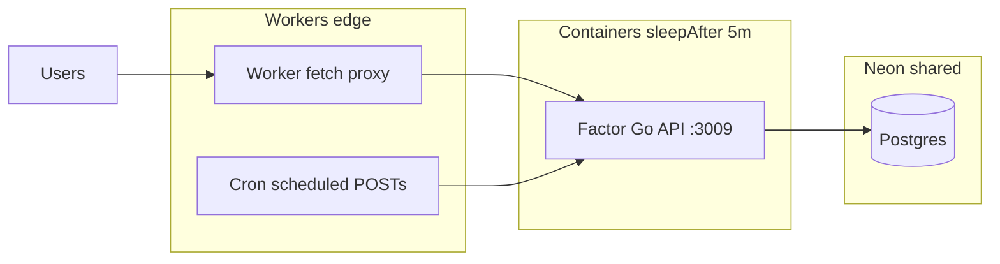

# Factor → Cloudflare Containers spike (2026-10-05)

**Status:** Staging deploy scaffold for **full Factor backend** (API + cron) on Cloudflare Containers. **No production cutover:** Fly `api.factor.trade` unchanged.

**Related code:**

- [`factor-cf-staging/`](../factor-cf-staging/) — **Factor Go API** (`Dockerfile.cf-api`) + Cron Triggers (target staging Worker)
- [`factor-cf-spike/`](../factor-cf-spike/) — tiny Alpine cold-start probe (live: `factor-cf-spike.sahilkapur-a.workers.dev`)

**Sahil direction (2026-10-05):** migrate **both** cron and core API to CF (shared Neon with Fly), then benchmark CF vs Fly cold/warm — not cron-only Phase A.

---

## 1. Current Factor on Fly (as mapped from this repo)

### Processes (`fly.toml`)

| Process | Command | Role |
| ------- | ------- | ---- |
| `web` | `/app/api` | Public Go API on `:3009` (Gin). Serves backtests, auth, investments, and **cron HTTP handlers**. |
| `cron` | `supercronic /app/crontab` | Always-on sidecar VM that **only schedules HTTP POSTs** to the web API. Does not run business logic locally. |

Fly app name: **`factorbacktest`**, region **`iad`**.

### VM sizing (both process groups)

```53:55:fly.toml
[[vm]]
  size = "shared-cpu-2x"
  memory = "1gb"
```

Each process group typically runs on **its own machine(s)**. Today that implies:

- **Web:** `min_machines_running = 1` with `auto_stop_machines = "stop"` / `auto_start_machines = true` — one warm web VM for interactive traffic.
- **Cron:** no `http_service` entry — the supercronic VM stays up to fire curls on an ET schedule (not scale-to-zero).

### What cron actually runs (`crontab`)

All jobs are **`curl -X POST`** to production API routes with `X-Cron-Secret: $CRON_SECRET`:

| Schedule (ET, weekdays) | Endpoint | Purpose |
| ----------------------- | -------- | ------- |
| 08:30 | `/internal/cron/sendSavedStrategySummaryEmails` | Saved-strategy summary email |
| 09:00 | `/internal/cron/updatePrices` | Ingest adjusted prices before rebalance |
| 10:00 | `/internal/cron/rebalance` | Portfolio rebalance |
| */15 10:00–16:00 | `/internal/cron/updateOrders` | Poll broker for fill updates |

Implementation lives in `api/api.go` (`/internal/cron/*` + `requireCronSecret`).

### Deploy / migrations

- Image: `Dockerfile.fly` → `api` + `migrate` binaries, Debian slim, supercronic (cron image only).
- `release_command = "/app/migrate"` runs before traffic shifts.
- Secrets: `FB_SECRETS_FROM_ENV=1` (Fly-injected env mirrors former `secrets.json`).

### Neon / Postgres dependencies

- Runtime: `DATABASE_URL` (pooled), migrations: `MIGRATE_DATABASE_URL` when set (`internal/util/util.go`).
- Pool tuned for Neon scale-to-zero: `MaxIdleConns=3`, `ConnMaxIdleTime=45s` (`cmd/util.go`) so idle Fly web does not keep Neon awake 24/7.
- **Every authenticated request** hits `app_auth.user_session` in Postgres (no in-process session cache) — safe for cold starts; adds one indexed read per request.

### OAuth / session / “always warm” state

| Concern | Needs always-on process? |
| ------- | ------------------------- |
| Google OAuth + SMS/email OTP | No — state in signed cookies + Postgres rows |
| Session cookies (`__Host-` prefix) | No — validated against Postgres each request |
| In-memory rate limiters (`golang.org/x/time/rate`) | **Soft** — reset on process cold start (acceptable for spike; document for prod migration) |
| Factor score cache | No — persisted in `factor_score` table |
| Cron mutex / overlap | Today: single supercronic VM; on CF use idempotent cron handlers + DO serialization (see CF cron example) |

**Not implemented in repo crontab:** `AuthSessionRepository.DeleteExpired` (auth README recommends external cron) — optional hygiene job if sessions grow.

### Frontend / API split

- **API:** Fly (`https://api.factor.trade`).
- **Frontend:** S3/CloudFront (`factor.trade`) — out of scope for this spike.

### Health / cheap read endpoints

- `GET /` → JSON welcome (used by Fly HTTP check) — minimal DB work.
- `GET /publishedStrategies` → landing-page data; heavier than `/` (see baseline below).

---

## 2. Target architecture (full Factor backend on Cloudflare)

**Goal:** One staging/production stack on CF: Worker edge + **Container running `/app/api`** + **Cron Triggers** posting to `/internal/cron/*` on the same container. **Neon URL shared with Fly** until cutover.



Implemented in [`factor-cf-staging/`](../factor-cf-staging/):

- `@cloudflare/containers` `FactorApiContainer` — `defaultPort = 3009`, `sleepAfter = 5m`, `enableInternet = true` (Neon)
- Worker `fetch` → `getContainer(FACTOR_API, "primary").fetch(request)` (all routes)
- Worker `scheduled` → POST `http://container/internal/cron/...` with `X-Cron-Secret` (mirrors supercronic)
- Container env from Worker secrets via `factorContainerEnv()` — same names as Fly `FB_SECRETS_FROM_ENV=1`
- Image: [`Dockerfile.cf-api`](../Dockerfile.cf-api) (Go API only; no supercronic)

**Staging URL (expected after deploy):** `https://factor-api-staging.sahilkapur-a.workers.dev`  
**Prod Fly unchanged:** `https://api.factor.trade`

**Deploy token:** use vault/secret **`CF_DEPLOY_RESUME_BUILDER`** (generic `CLOUDFLARE_API_TOKEN` returns **403 on Containers**).

### Cron on Cloudflare (concrete)

- **Cron expression granularity:** 1-minute steps; **wall-clock execution budget ~15 minutes** per trigger ([Cron Triggers](https://developers.cloudflare.com/workers/configuration/cron-triggers/)).
- Factor longest job must stay **well under 15m** (rebalance + updateOrders today run on web process — measure before migration).
- Use **one Durable Object** per cron scheduler (`getByName("factor-cron")`) so overlapping ticks wait (CF example pattern) — jobs must stay **idempotent** (already required for broker/cron safety).

### Risks and mitigations

| Risk | Notes |
| ---- | ----- |
| **Container cold start** | Public CF Containers rebuild ~**648ms median** (Birthday Week 2025 announcement) — Sahil’s bar for interactive Factor. Must measure with **real `Dockerfile.fly` image**, not just Alpine spike. |
| **Neon wake on cold** | Scale-to-zero compute adds **~0.5–3s** depending on idle time; pool settings help only when warm. |
| **OAuth / cookies** | Cross-domain FE/API unchanged until DNS moves; `__Host-` cookies require HTTPS and correct host. |
| **Jobs > 15m** | Not supported on Cron Triggers; would need Queues, Workflow, or stay on Fly for that job. |
| **Docker image size / pull time** | Local build: **~25MB** Go `api` binary alone; full runtime image likely **~100–150MB+** (Debian + migrate + templates). Affects cold pull. |
| **DO / Container SDK migration** | Cloudflare deadline **2026-12-31** for legacy Container class patterns — use current `wrangler.toml` `[[containers]]` + `exports` layout (see spike). |
| **In-memory rate limits** | Cold start resets buckets — acceptable for auth abuse protection if combined with Twilio/Resend limits. |
| **Money path** | `rebalance`, `updateOrders`, Alpaca — **no prod DNS cutover** until cron + interactive cold paths are proven in staging. |

---

## 3. Fly baseline measurements (2026-10-05, Cloud Agent)

### Method

From the Cloud Agent VM (network path ≠ typical user, but consistent for A/B):

```bash
curl -sS -o /dev/null -w 'ttfb=%{time_starttransfer}s total=%{time_total}s code=%{http_code}\n' URL
```

- **Target:** production `https://api.factor.trade` (Fly **web** process, warm `min_machines_running = 1`).
- **Cold Fly machine:** **Not measured** — would require `flyctl machine stop` on a **non-prod** app; this agent has **no `FLY_API_TOKEN` / flyctl** and instructions forbid stopping prod.

### Results (warm)

| Endpoint | n | TTFB min | TTFB median | TTFB max | Notes |
| -------- | - | -------- | ----------- | -------- | ----- |
| `GET /` | 5 | 58ms | **68ms** | 95ms | Warm web VM |
| `GET /publishedStrategies` | 5 | 98ms | **99ms** | 751ms | Neon read; one 751ms outlier |
| Fly cold machine | — | — | **not measured** | — | No `flyctl` / no non-prod stop |

### Cloudflare measurements (2026-10-05)

| Target | Endpoint | Median TTFB | Notes |
| ------ | -------- | ----------- | ----- |
| **Spike (live)** | `GET /health` | **~101ms warm**; **~2.2s after 3m idle** (2026-10-05 agent) | Sahil **~1.0s cold** median (Alpine); use `COLD_IDLE_SEC=180` in `scripts/benchmark.sh` |
| **Staging API** | `GET /` | **not deployed** | `factor-api-staging…workers.dev` returns **404** until `scripts/deploy.sh` + secrets |

Deploy staging (from repo):

```bash
cd factor-cf-staging
cp secrets.example.env .dev.vars   # fill from Fly secrets — never commit
export CF_DEPLOY_RESUME_BUILDER='…'
export CLOUDFLARE_ACCOUNT_ID='…'
bash scripts/deploy.sh
COLD_IDLE_SEC=300 bash scripts/benchmark.sh
```

### Cloudflare deploy blockers (Cloud Agent 2026-10-05)

1. **`CF_DEPLOY_RESUME_BUILDER`** — not in agent env (403 if using wrong token)
2. **`CLOUDFLARE_ACCOUNT_ID`**
3. **`.dev.vars`** — Fly-equivalent secrets (`DATABASE_URL`, `CRON_SECRET`, Alpaca, auth, …)
4. Docker — available after manual `dockerd` start in agent; use Docker Desktop locally

---

## 4. Cost estimate (rough, before/after)

Prices vary by contract; treat as **order-of-magnitude** for go/no-go discussion.

### Today — Fly always-on (this repo config)

| Component | Assumption | Approx monthly |
| --------- | ---------- | -------------- |
| Web VM | 1× `shared-cpu-2x` 1GB always on | ~\$10–15 |
| Cron VM | 1× same size always on (supercronic) | ~\$10–15 |
| **Subtotal Fly compute** | 2 machines | **~\$20–30** |

Neon, Alpaca, Twilio, Resend, AWS frontend, etc. unchanged.

Draft PR **#169** (1×/512 shrink) reduces web cost but is **orthogonal** to this spike.

### Target — CF scale-to-zero (steady state)

| Component | Assumption | Approx monthly |
| --------- | ---------- | -------------- |
| Workers Paid | Already subscribed | \$5 (existing) |
| Containers | Included allotment + usage when awake | Often **\$0–10** for cron-heavy / low QPS if sleep-to-zero |
| Fly web + cron (both always-on) | **~\$20–30** | Removed after CF cutover |
| CF Workers Paid + Containers sleep | **~\$5–15** typical low QPS | Shared Neon unchanged |

**Win condition:** Drop **both** Fly VMs when CF cold+warm TTFB meets Sahil’s bar and cron proves reliable for 1–2 weeks on staging.


---

## 5. Go / no-go gates (explicit)

| Gate | Threshold | Measured? |
| ---- | --------- | --------- |
| Interactive cold (Go image + Neon) | TTFB **≤ ~700ms p50** on `/` and `/publishedStrategies` | **Pending** staging deploy |
| Interactive warm | ≤ Fly warm (~70–100ms `/`, ~100ms published) | Fly measured; CF pending |
| Cron | All four jobs fire; idempotent; **< 15m** | Pending staging |
| Cost | Both Fly VMs eliminated at steady state | Estimate only |

**Next:** Deploy `factor-cf-staging` with `CF_DEPLOY_RESUME_BUILDER` → benchmark → if gates pass, plan DNS cutover (`api.factor.trade`) as a **separate explicit approval**.

---

## 6. Non-prod projects

| Directory | Purpose |
| --------- | ------- |
| [`factor-cf-staging/`](../factor-cf-staging/) | Full Go API + cron crons on Worker |
| [`factor-cf-spike/`](../factor-cf-spike/) | Alpine `/health` latency probe |

---

## References

- [Cloudflare Containers cron example](https://developers.cloudflare.com/containers/examples/cron/)
- [Workers Cron Triggers](https://developers.cloudflare.com/workers/configuration/cron-triggers/)
- Factor Fly config: [`fly.toml`](../fly.toml), [`crontab`](../crontab), [`Dockerfile.fly`](../Dockerfile.fly)
- Latency runbook (Fly vs Lambda): [`docs/latency.md`](latency.md) — note `min_machines_running` in runbook text may predate current `fly.toml` value of **1**.
