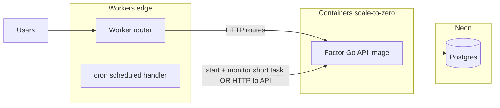

# Factor → Cloudflare Containers spike (2026-10-05)

**Status:** Research + non-prod scaffold only. **No production cutover** in this work: Fly `min_machines_running`, DNS (`api.factor.trade`), and cron machines are unchanged.

**Related code:** [`factor-cf-spike/`](../factor-cf-spike/) (Worker + Container + Cron Trigger).

---

## 1. Current Factor on Fly (as mapped from this repo)

### Processes (`fly.toml`)

| Process | Command | Role |
| ------- | ------- | ---- |
| `web` | `/app/api` | Public Go API on `:3009` (Gin). Serves backtests, auth, investments, and **cron HTTP handlers**. |
| `cron` | `supercronic /app/crontab` | Always-on sidecar VM that **only schedules HTTP POSTs** to the web API. Does not run business logic locally. |

Fly app name: **`factorbacktest`**, region **`iad`**.

### VM sizing (both process groups)

```53:55:fly.toml
[[vm]]
  size = "shared-cpu-2x"
  memory = "1gb"
```

Each process group typically runs on **its own machine(s)**. Today that implies:

- **Web:** `min_machines_running = 1` with `auto_stop_machines = "stop"` / `auto_start_machines = true` — one warm web VM for interactive traffic.
- **Cron:** no `http_service` entry — the supercronic VM stays up to fire curls on an ET schedule (not scale-to-zero).

### What cron actually runs (`crontab`)

All jobs are **`curl -X POST`** to production API routes with `X-Cron-Secret: $CRON_SECRET`:

| Schedule (ET, weekdays) | Endpoint | Purpose |
| ----------------------- | -------- | ------- |
| 08:30 | `/internal/cron/sendSavedStrategySummaryEmails` | Saved-strategy summary email |
| 09:00 | `/internal/cron/updatePrices` | Ingest adjusted prices before rebalance |
| 10:00 | `/internal/cron/rebalance` | Portfolio rebalance |
| */15 10:00–16:00 | `/internal/cron/updateOrders` | Poll broker for fill updates |

Implementation lives in `api/api.go` (`/internal/cron/*` + `requireCronSecret`).

### Deploy / migrations

- Image: `Dockerfile.fly` → `api` + `migrate` binaries, Debian slim, supercronic (cron image only).
- `release_command = "/app/migrate"` runs before traffic shifts.
- Secrets: `FB_SECRETS_FROM_ENV=1` (Fly-injected env mirrors former `secrets.json`).

### Neon / Postgres dependencies

- Runtime: `DATABASE_URL` (pooled), migrations: `MIGRATE_DATABASE_URL` when set (`internal/util/util.go`).
- Pool tuned for Neon scale-to-zero: `MaxIdleConns=3`, `ConnMaxIdleTime=45s` (`cmd/util.go`) so idle Fly web does not keep Neon awake 24/7.
- **Every authenticated request** hits `app_auth.user_session` in Postgres (no in-process session cache) — safe for cold starts; adds one indexed read per request.

### OAuth / session / “always warm” state

| Concern | Needs always-on process? |
| ------- | ------------------------- |
| Google OAuth + SMS/email OTP | No — state in signed cookies + Postgres rows |
| Session cookies (`__Host-` prefix) | No — validated against Postgres each request |
| In-memory rate limiters (`golang.org/x/time/rate`) | **Soft** — reset on process cold start (acceptable for spike; document for prod migration) |
| Factor score cache | No — persisted in `factor_score` table |
| Cron mutex / overlap | Today: single supercronic VM; on CF use idempotent cron handlers + DO serialization (see CF cron example) |

**Not implemented in repo crontab:** `AuthSessionRepository.DeleteExpired` (auth README recommends external cron) — optional hygiene job if sessions grow.

### Frontend / API split

- **API:** Fly (`https://api.factor.trade`).
- **Frontend:** S3/CloudFront (`factor.trade`) — out of scope for this spike.

### Health / cheap read endpoints

- `GET /` → JSON welcome (used by Fly HTTP check) — minimal DB work.
- `GET /publishedStrategies` → landing-page data; heavier than `/` (see baseline below).

---

## 2. Target architecture (Cloudflare, scale-to-zero friendly)

### Recommended phased shape



**Phase A — Cron only (lowest risk, largest always-on savings):**

Replace Fly **`cron` process group** with **Workers Cron Triggers** that either:

1. **Thin Worker** POSTs to existing `/internal/cron/*` on Fly or staging API (same as supercronic today), or
2. **Cron Container** (Durable Object scheduling policy) runs `curl` with secret injected via Worker secret → exits (see [CF cron container example](https://developers.cloudflare.com/containers/examples/cron/)).

Eliminates **one always-on shared-cpu-2x/1GB VM** while keeping the web API on Fly until cold-start proof exists.

**Phase B — Interactive API on Containers (higher risk):**

- Worker terminates TLS, optional WAF, routes `/` + API paths to a **Container** running `/app/api`.
- Keep **OAuth redirect URLs** stable (`APP_BASE_URL=https://api.factor.trade`) until deliberate DNS cutover.
- Neon remains source of truth; expect **Neon compute wake** on cold paths in addition to container start.

**Phase C — Workers for truly thin routes (optional):**

Only if we extract stateless handlers (e.g. static JSON, redirects). The Go monolith is large; default is **Container for fat binary**, not a rewrite.

### Cron on Cloudflare (concrete)

- **Cron expression granularity:** 1-minute steps; **wall-clock execution budget ~15 minutes** per trigger ([Cron Triggers](https://developers.cloudflare.com/workers/configuration/cron-triggers/)).
- Factor longest job must stay **well under 15m** (rebalance + updateOrders today run on web process — measure before migration).
- Use **one Durable Object** per cron scheduler (`getByName("factor-cron")`) so overlapping ticks wait (CF example pattern) — jobs must stay **idempotent** (already required for broker/cron safety).

### Risks and mitigations

| Risk | Notes |
| ---- | ----- |
| **Container cold start** | Public CF Containers rebuild ~**648ms median** (Birthday Week 2025 announcement) — Sahil’s bar for interactive Factor. Must measure with **real `Dockerfile.fly` image**, not just Alpine spike. |
| **Neon wake on cold** | Scale-to-zero compute adds **~0.5–3s** depending on idle time; pool settings help only when warm. |
| **OAuth / cookies** | Cross-domain FE/API unchanged until DNS moves; `__Host-` cookies require HTTPS and correct host. |
| **Jobs > 15m** | Not supported on Cron Triggers; would need Queues, Workflow, or stay on Fly for that job. |
| **Docker image size / pull time** | Local build: **~25MB** Go `api` binary alone; full runtime image likely **~100–150MB+** (Debian + migrate + templates). Affects cold pull. |
| **DO / Container SDK migration** | Cloudflare deadline **2026-12-31** for legacy Container class patterns — use current `wrangler.toml` `[[containers]]` + `exports` layout (see spike). |
| **In-memory rate limits** | Cold start resets buckets — acceptable for auth abuse protection if combined with Twilio/Resend limits. |
| **Money path** | `rebalance`, `updateOrders`, Alpaca — **no prod DNS cutover** until cron + interactive cold paths are proven in staging. |

---

## 3. Fly baseline measurements (2026-10-05, Cloud Agent)

### Method

From the Cloud Agent VM (network path ≠ typical user, but consistent for A/B):

```bash
curl -sS -o /dev/null -w 'ttfb=%{time_starttransfer}s total=%{time_total}s code=%{http_code}\n' URL
```

- **Target:** production `https://api.factor.trade` (Fly **web** process, warm `min_machines_running = 1`).
- **Cold Fly machine:** **Not measured** — would require `flyctl machine stop` on a **non-prod** app; this agent has **no `FLY_API_TOKEN` / flyctl** and instructions forbid stopping prod.

### Results (warm)

| Endpoint | n | TTFB min | TTFB median | TTFB max | Notes |
| -------- | - | -------- | ----------- | -------- | ----- |
| `GET /` | 5 | 67ms | **93ms** | 153ms | Fly health check path; minimal handler |
| `GET /publishedStrategies` | 6 | 99ms | **125ms** | 1.24s | First sample after `/` was 1.24s outlier; subsequent 99–246ms |

Historical comment in `fly.toml` cites warm TTFB **~250–360ms** for `/publishedStrategies` when marketing landing was sensitive to cold starts — current sample median is lower but still route-dependent.

### Cloudflare spike measurements

**Not run** — `CLOUDFLARE_API_TOKEN` and `CLOUDFLARE_ACCOUNT_ID` were **not** present in the Cloud Agent environment. Deploy [`factor-cf-spike/`](../factor-cf-spike/) and follow its README to capture cold `/health` TTFB.

---

## 4. Cost estimate (rough, before/after)

Prices vary by contract; treat as **order-of-magnitude** for go/no-go discussion.

### Today — Fly always-on (this repo config)

| Component | Assumption | Approx monthly |
| --------- | ---------- | -------------- |
| Web VM | 1× `shared-cpu-2x` 1GB always on | ~\$10–15 |
| Cron VM | 1× same size always on (supercronic) | ~\$10–15 |
| **Subtotal Fly compute** | 2 machines | **~\$20–30** |

Neon, Alpaca, Twilio, Resend, AWS frontend, etc. unchanged.

Draft PR **#169** (1×/512 shrink) reduces web cost but is **orthogonal** to this spike.

### Target — CF scale-to-zero (steady state)

| Component | Assumption | Approx monthly |
| --------- | ---------- | -------------- |
| Workers Paid | Already subscribed | \$5 (existing) |
| Containers | Included allotment + usage when awake | Often **\$0–10** for cron-heavy / low QPS if sleep-to-zero |
| Fly web only (Phase A) | Keep 1 warm web VM during transition | ~\$10–15 until Phase B |

**Win condition:** Remove **cron always-on VM** (~half of Fly compute) **plus**, if interactive cold TTFB ≤ Sahil’s budget, eventually remove web always-on VM.

**Loss condition:** CF “always warm” basic pricing or frequent wakes (cron + health polls + Neon keepalive) **exceeds** sleepy Fly — unlikely for **cron-only** Phase A.

---

## 5. Go / no-go gates (explicit)

| Gate | Threshold | Measured? |
| ---- | --------- | --------- |
| Interactive cold container + app | TTFB **≤ ~700ms p50** (Sahil CF Containers bar) on **`Dockerfile.fly` image** hitting `GET /` or `/publishedStrategies` | **No** — deploy spike v2 |
| Interactive warm | Match or beat current warm **~100–150ms** TTFB for hot routes | Partial (Fly only) |
| Cron cold | Accept **multi-second** wake if daily/hourly jobs; must finish **< 15m** | Not measured |
| Neon cold add-on | Document separately; total user-facing latency = container + Neon | Not measured |
| Rebalance correctness | Integration tests + paper/staging broker | Existing CI — rerun on staging CF |
| Cost | Phase A saves ≥1 Fly VM without raising CF bill materially | Estimate only |

**Decision tree:**

- **Ship spike deploy** → run `factor-cf-spike`, then `Dockerfile.fly` staging worker, collect cold/warm tables.
- **Hold** → cron-on-CF + Fly web if container cold fails interactive bar but cron savings matter.
- **Abort CF interactive** → keep Fly web; optionally still move cron to CF Worker POSTs.

---

## 6. Non-prod spike (`factor-cf-spike/`)

Scaffold includes:

- Worker `GET /health` → cold-start Container (Alpine + busybox httpd).
- Cron `0 14 * * *` UTC → one-shot container task (`REASON=cron:…` exits 0).
- `wrangler.toml` with `scheduling_policy = "durable_object"`.

### Deploy blockers (this environment)

1. `CLOUDFLARE_API_TOKEN` (Workers + Account + Containers scopes)
2. `CLOUDFLARE_ACCOUNT_ID`
3. Docker for image build during `wrangler deploy`
4. Optional: dedicated CF subdomain / route — use `workers.dev` first

### Recommended next step

1. **Deploy `factor-cf-spike`** from a machine with CF credentials; record **5× cold** `/health` TTFB + Worker logs.
2. **Promote spike** to slim Go image (`Dockerfile.fly` subset) on a **`api-staging.*`** hostname (no prod DNS).
3. **Phase A prod:** Cron Trigger Worker POST → existing Fly cron routes; **delete cron Fly process** only after 1–2 weeks of successful fires.
4. **Phase B:** Re-evaluate moving `web` to Containers against measured cold TTFB + Neon.

---

## References

- [Cloudflare Containers cron example](https://developers.cloudflare.com/containers/examples/cron/)
- [Workers Cron Triggers](https://developers.cloudflare.com/workers/configuration/cron-triggers/)
- Factor Fly config: [`fly.toml`](../fly.toml), [`crontab`](../crontab), [`Dockerfile.fly`](../Dockerfile.fly)
- Latency runbook (Fly vs Lambda): [`docs/latency.md`](latency.md) — note `min_machines_running` in runbook text may predate current `fly.toml` value of **1**.
